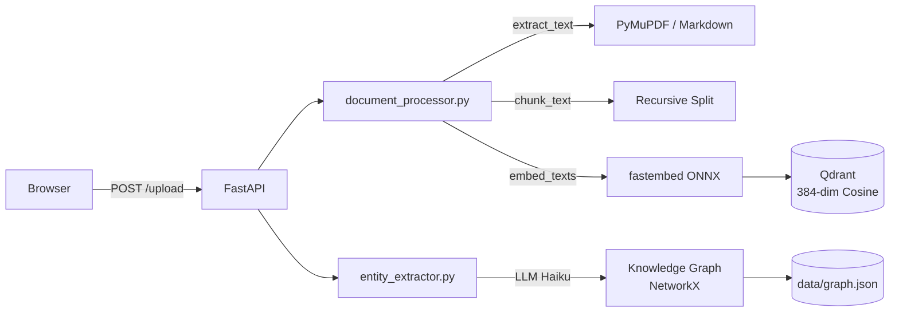
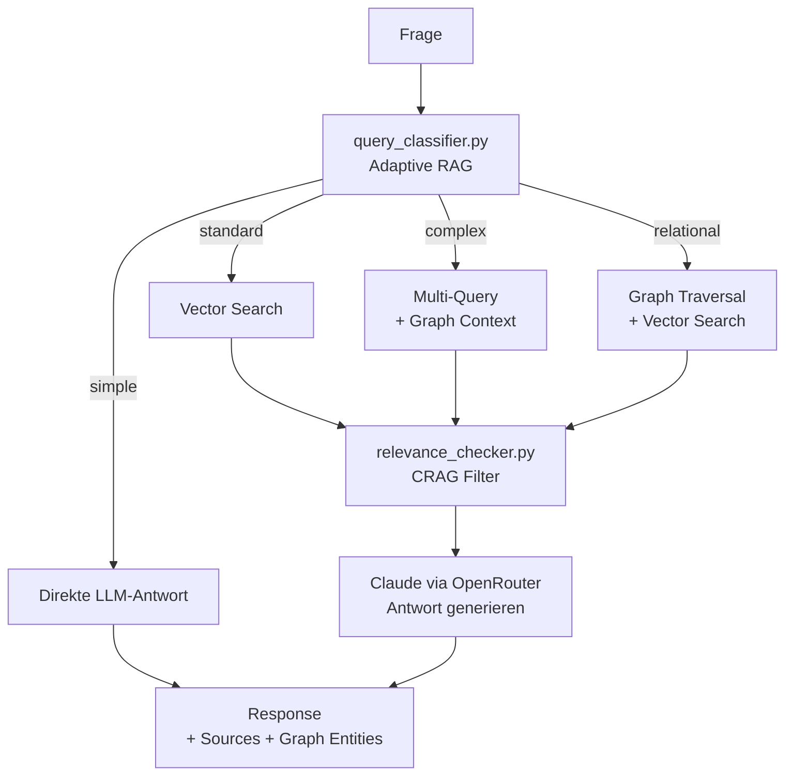
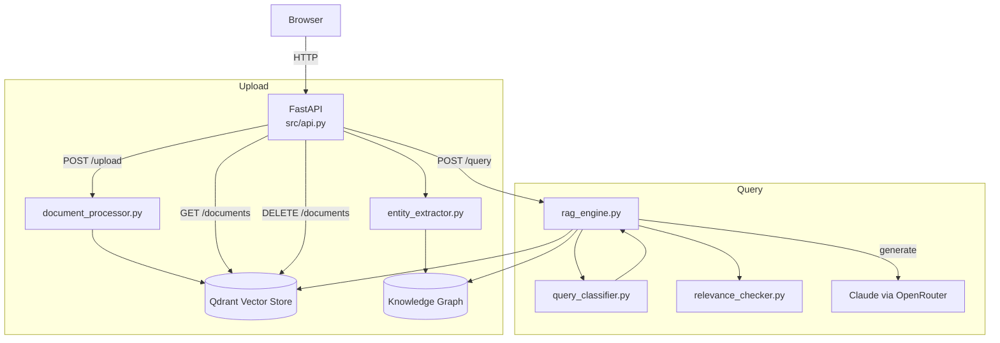

# RAG Hybrid Chatbot


**Hybrid RAG: Vector Search + Knowledge Graph mit adaptivem Query-Routing.**

RAG (Retrieval-Augmented Generation) Chatbot mit Vector Search (Qdrant), Graph RAG (NetworkX), Adaptive Routing und CRAG. FastAPI, Claude via OpenRouter, lokale Embeddings ohne externe API-Abhaengigkeit.


## Quick Start (Docker)

```bash
# 1. Clone
git clone https://github.com/mj-deving/rag-hybrid-chatbot.git
cd rag-hybrid-chatbot

# 2. API Key konfigurieren
echo 'OPENROUTER_API_KEY=sk-or-v1-...' > .env

# 3. Starten
docker compose up --build
# -> http://localhost:8000
```

Vektordaten werden in `data/qdrant/` persistiert und ueberleben Container-Neustarts.

## Quick Start (Lokal)

```bash
# 1. Clone
git clone https://github.com/mj-deving/rag-hybrid-chatbot.git
cd rag-hybrid-chatbot

# 2. Setup
python3 -m venv venv
source venv/bin/activate
pip install -r requirements.txt

# 3. API Key konfigurieren
echo 'OPENROUTER_API_KEY=sk-or-v1-...' >> ~/.claude/.env
# Oder: export OPENROUTER_API_KEY=sk-or-v1-...

# 4. Server starten
python src/main.py
# -> http://localhost:8000
```

## Features

- **Dokument-Upload** -- PDF, Markdown, TXT per Drag-and-Drop oder API
- **Automatisches Chunking** -- Rekursives Splitting (~500 Tokens, 50 Overlap)
- **Lokale Embeddings** -- fastembed (paraphrase-multilingual-MiniLM-L12-v2, 384-dim, ONNX) -- kein API Key noetig
- **Vector Search** -- Qdrant In-Memory mit Cosine Similarity
- **Adaptive RAG** -- Query-Routing: einfache Fragen direkt beantworten, dokumentspezifische via Vector Search, komplexe via Multi-Query-Decomposition
- **Graph RAG** -- Knowledge Graph aus Entitäten und Relationen (NetworkX), automatisch bei Upload extrahiert, RELATIONAL-Route fuer Beziehungsfragen
- **Corrective RAG (CRAG)** -- Post-Retrieval Relevanz-Check filtert irrelevante Chunks, Fallback bei fehlender Relevanz
- **LLM-Antworten** -- Claude via OpenRouter mit Quellenangaben
- **Chat UI** -- Single-Page HTML mit Dark Theme, responsive, zeigt Route und Retrieval-Qualitaet
- **REST API** -- 4 Endpoints mit Swagger UI unter `/docs`

## Architektur

### Upload Pipeline



### Query Pipeline



### Gesamtuebersicht



## API Endpoints

| Methode | Pfad | Beschreibung |
|---------|------|--------------|
| `POST` | `/upload` | Datei hochladen und indexieren |
| `POST` | `/query` | Frage stellen, Antwort mit Quellen |
| `GET` | `/documents` | Alle indexierten Dokumente auflisten |
| `DELETE` | `/documents/{id}` | Dokument und Vektoren entfernen |

### Beispiele

```bash
# Dokument hochladen
curl -X POST http://localhost:8000/upload \
  -F "file=@dokument.md"

# Frage stellen (Response enthaelt routing + retrieval_quality)
curl -X POST http://localhost:8000/query \
  -H "Content-Type: application/json" \
  -d '{"question": "Was ist der November-2025-Wendepunkt?", "top_k": 5}'

# Dokumente auflisten
curl http://localhost:8000/documents

# Relationale Frage (Graph RAG)
curl -X POST http://localhost:8000/query \
  -H "Content-Type: application/json" \
  -d '{"question": "Welche Organisationen arbeiten zusammen?"}'
# Response enthaelt "graph_entities" mit Entitaeten und Relationen

# Dokument loeschen
curl -X DELETE http://localhost:8000/documents/{document_id}
```

## Projektstruktur

```
src/
  api.py                 # FastAPI Endpoints
  llm_client.py          # Shared OpenRouter Client + Konstanten
  query_classifier.py    # Adaptive RAG: Query-Routing (simple/standard/complex/relational)
  relevance_checker.py   # CRAG: Post-Retrieval Relevanz-Check
  document_processor.py  # Text-Extraktion, Chunking, Embedding
  vector_store.py        # Qdrant Persistent Storage (data/qdrant/)
  knowledge_graph.py     # Knowledge Graph (NetworkX, JSON-persistent)
  entity_extractor.py    # LLM-basierte Entitaets- und Relationsextraktion
  rag_engine.py          # RAG Orchestrator (Classify -> Route -> Retrieve -> Filter -> Generate)
  main.py                # Server-Startup
static/
  index.html             # Chat UI (Single-File, kein Build)
scripts/
  upload_test_docs.py    # 5 Testdokumente hochladen + abfragen
tests/
  test_document_processor.py
  test_vector_store.py
  test_knowledge_graph.py
  test_entity_extractor.py
  test_query_classifier.py
  test_relevance_checker.py
  test_api.py
```

## Tech Stack

| Komponente | Tool |
|------------|------|
| API Framework | FastAPI + Uvicorn |
| Vector DB | Qdrant (persistent file-based, kein Docker noetig) |
| Embeddings | fastembed / paraphrase-multilingual-MiniLM-L12-v2 (ONNX, lokal, konfigurierbar) |
| Knowledge Graph | NetworkX (In-Memory, JSON-persistent) |
| LLM | Claude Sonnet via OpenRouter |
| PDF Parsing | PyMuPDF |
| Frontend | Vanilla HTML/CSS/JS |

## Tests

```bash
pytest tests/ -v
# 61 Tests: document_processor (9), vector_store (7), knowledge_graph (14), entity_extractor (5), query_classifier (6), relevance_checker (5), api (14), main (1)
```

## Konfiguration

Der Server liest API Keys aus `~/.claude/.env` oder Umgebungsvariablen:

| Variable | Zweck | Default |
|----------|-------|---------|
| `OPENROUTER_API_KEY` | LLM-Zugang (Claude via OpenRouter) | (erforderlich) |
| `RAG_API_KEY` | Bearer-Token fuer API-Authentifizierung | (leer = Auth deaktiviert) |
| `EMBEDDING_MODEL` | fastembed Modellname | `sentence-transformers/paraphrase-multilingual-MiniLM-L12-v2` |
| `EMBEDDING_DIM` | Vektor-Dimension passend zum Modell | `384` |
| `QDRANT_PATH` | Pfad fuer persistente Qdrant-Daten | `data/qdrant/` |
| `GRAPH_PATH` | Pfad fuer persistenten Knowledge Graph | `data/graph.json` |

Embeddings laufen lokal -- kein weiterer Key noetig.
Fuer englischsprachige Dokumente: `EMBEDDING_MODEL=BAAI/bge-small-en-v1.5`.

## Einschraenkungen

- **Embedding-Modell**: paraphrase-multilingual-MiniLM-L12-v2 ist der Default (optimiert fuer Deutsch und 50+ Sprachen). Fuer rein englische Corpora kann `BAAI/bge-small-en-v1.5` via Env-Var gesetzt werden — leicht hoehere Englisch-Praezision, aber schlechtere Trennung bei deutschen Queries

## License

MIT
