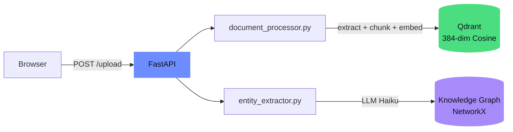
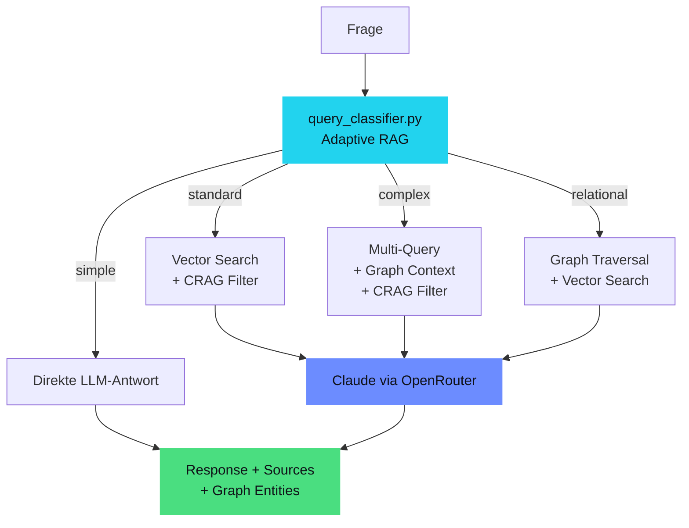
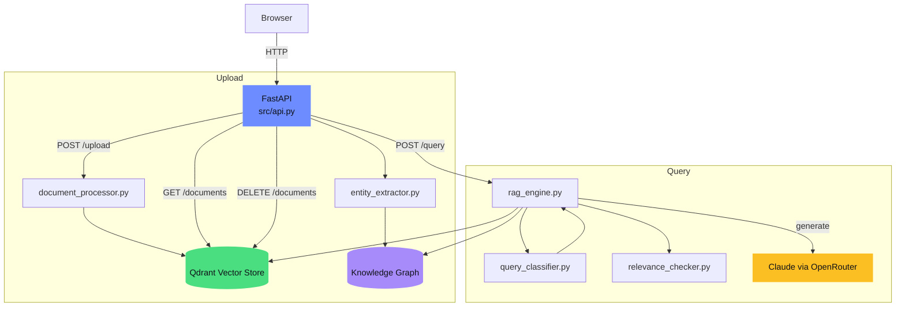

# RAG Hybrid Chatbot

[](#tech-stack)
[](#tech-stack)
[](#tests)
[](#quick-start-docker)
[](#license)

**Hybrid RAG: Vector Search + Knowledge Graph mit adaptivem Query-Routing.**

RAG (Retrieval-Augmented Generation) Chatbot mit Vector Search (Qdrant), Graph RAG (NetworkX), Adaptive Routing und CRAG. FastAPI, Claude via OpenRouter, lokale Embeddings ohne externe API-Abhaengigkeit.


## Table of Contents

- [Quick Start (Docker)](#quick-start-docker) — ein Befehl, laeuft
- [Quick Start (Lokal)](#quick-start-lokal) — venv + pip
- [Features](#features) — was der Chatbot kann
- [Architektur](#architektur) — Upload Pipeline, Query Pipeline, Gesamtuebersicht
- [Query Routing](#query-routing) — 4 Routen im Vergleich
- [API Endpoints](#api-endpoints) — REST API mit Beispielen
- [Projektstruktur](#projektstruktur) — Dateien und Module
- [Tech Stack](#tech-stack) — Versionen und Komponenten
- [Tests](#tests) — 61 Tests, kein API-Call noetig
- [Konfiguration](#konfiguration) — Env-Variablen
- [License](#license)

## Quick Start (Docker)

```bash
# 1. Clone
git clone https://github.com/mj-deving/rag-hybrid-chatbot.git
cd rag-hybrid-chatbot

# 2. API Key konfigurieren
echo 'OPENROUTER_API_KEY=sk-or-v1-...' > .env

# 3. Starten
docker compose up --build
# -> http://localhost:8000
```

Vektordaten werden in `data/qdrant/` und der Knowledge Graph in `data/graph.json` persistiert — beides ueberlebt Container-Neustarts.

## Quick Start (Lokal)

```bash
# 1. Clone
git clone https://github.com/mj-deving/rag-hybrid-chatbot.git
cd rag-hybrid-chatbot

# 2. Setup
python3 -m venv venv
source venv/bin/activate
pip install -r requirements.txt

# 3. API Key konfigurieren
echo 'OPENROUTER_API_KEY=sk-or-v1-...' >> ~/.claude/.env
# Oder: export OPENROUTER_API_KEY=sk-or-v1-...

# 4. Server starten
python src/main.py
# -> http://localhost:8000
```

## Features

- **Dokument-Upload** — PDF, Markdown, TXT per Drag-and-Drop oder API
- **Automatisches Chunking** — Rekursives Splitting (~500 Tokens, 50 Overlap)
- **Lokale Embeddings** — fastembed (paraphrase-multilingual-MiniLM-L12-v2, 384-dim, ONNX) — kein API Key noetig
- **Vector Search** — Qdrant mit Cosine Similarity, persistent file-based
- **Graph RAG** — Knowledge Graph aus Entitaeten und Relationen (NetworkX), automatisch bei Upload extrahiert
- **Adaptive RAG** — 4-Wege Query-Routing: simple, standard, complex, relational
- **Corrective RAG (CRAG)** — Post-Retrieval Relevanz-Check filtert irrelevante Chunks
- **LLM-Antworten** — Claude via OpenRouter mit Quellenangaben
- **Chat UI** — Single-Page HTML mit Dark Theme, responsive
- **REST API** — 4 Endpoints mit Swagger UI unter `/docs`

## Architektur

### Upload Pipeline



### Query Pipeline



### Gesamtuebersicht



## Query Routing

Der Classifier entscheidet automatisch anhand der Frage, welche Route genutzt wird:

| Route | Wann | Retrieval | Graph | Beispiel |
|-------|------|-----------|-------|----------|
| **simple** | Allgemeine Wissensfragen | — | — | "Was ist RAG?" |
| **standard** | Dokumentspezifische Fragen | Vector Search + CRAG | — | "Was sagt Willison ueber November 2025?" |
| **complex** | Vergleichende Multi-Aspekt-Fragen | Parallele Sub-Queries + CRAG | Context | "Vergleiche die RAG-Architekturen" |
| **relational** | Beziehungen zwischen Entitaeten | Fallback | Traversal | "Wer arbeitet mit wem?" |

## API Endpoints

| Methode | Pfad | Beschreibung |
|---------|------|--------------|
| `POST` | `/upload` | Datei hochladen und indexieren |
| `POST` | `/query` | Frage stellen, Antwort mit Quellen |
| `GET` | `/documents` | Alle indexierten Dokumente auflisten |
| `DELETE` | `/documents/{id}` | Dokument und Vektoren entfernen |

### `POST /upload`

```bash
curl -X POST http://localhost:8000/upload -F "file=@dokument.md"
```

**Response:**
```json
{
  "document_id": "a1b2c3d4e5f6",
  "filename": "dokument.md",
  "chunks": 3,
  "status": "indexed"
}
```

### `POST /query`

```bash
curl -X POST http://localhost:8000/query \
  -H "Content-Type: application/json" \
  -d '{"question": "Was ist der November-2025-Wendepunkt?", "top_k": 5}'
```

**Response:**
```json
{
  "answer": "Laut dem Dokument...",
  "sources": [
    {"document": "bericht.md", "chunk": 2, "relevance": 0.8734}
  ],
  "tokens_used": 1250,
  "routing": {
    "route": "standard",
    "sub_queries": [],
    "entity_names": []
  },
  "retrieval_quality": {
    "chunks_retrieved": 5,
    "chunks_relevant": 3,
    "chunks_filtered": 2,
    "fallback_triggered": false
  },
  "graph_entities": null
}
```

### `POST /query` (relational)

```bash
curl -X POST http://localhost:8000/query \
  -H "Content-Type: application/json" \
  -d '{"question": "Welche Organisationen arbeiten zusammen?"}'
```

**Response (mit Graph Entities):**
```json
{
  "answer": "Im Knowledge Graph sind folgende Verbindungen...",
  "sources": [],
  "tokens_used": 800,
  "routing": {
    "route": "relational",
    "sub_queries": [],
    "entity_names": ["Acme Corp", "TechStart GmbH"]
  },
  "graph_entities": [
    {
      "name": "Acme Corp",
      "type": "organization",
      "neighbors": [
        {"entity": "TechStart GmbH", "relation": "kooperiert_mit"}
      ]
    }
  ]
}
```

### Weitere Endpoints

```bash
# Dokumente auflisten
curl http://localhost:8000/documents

# Dokument loeschen
curl -X DELETE http://localhost:8000/documents/{document_id}
```

## Projektstruktur

```
rag-hybrid-chatbot/
├── src/
│   ├── api.py                 # FastAPI Endpoints
│   ├── llm_client.py          # Shared OpenRouter Client + Konstanten
│   ├── query_classifier.py    # Adaptive RAG: 4-Wege Query-Routing
│   ├── relevance_checker.py   # CRAG: Post-Retrieval Relevanz-Check
│   ├── document_processor.py  # Text-Extraktion, Chunking, Embedding
│   ├── vector_store.py        # Qdrant Persistent Storage
│   ├── knowledge_graph.py     # Knowledge Graph (NetworkX, JSON-persistent)
│   ├── entity_extractor.py    # LLM-basierte Entitaets-Extraktion
│   ├── rag_engine.py          # RAG Orchestrator
│   └── main.py                # Server-Startup
├── static/
│   └── index.html             # Chat UI (Single-File, kein Build)
├── scripts/
│   └── upload_test_docs.py    # Test-Dokumente hochladen + abfragen
├── tests/                     # 61 pytest Tests
├── Dockerfile                 # Python 3.12-slim
├── docker-compose.yml         # One-command Setup
├── requirements.txt
└── README.md
```

## Tech Stack

| Komponente | Tool | Version |
|------------|------|---------|
| Runtime | Python | 3.12+ |
| API Framework | FastAPI + Uvicorn | 0.135 / 0.44 |
| Vector DB | Qdrant (persistent file-based) | 1.17 |
| Embeddings | fastembed / multilingual-MiniLM-L12-v2 (ONNX) | 0.8 |
| Knowledge Graph | NetworkX (In-Memory, JSON-persistent) | 3.6 |
| LLM | Claude Sonnet via OpenRouter | openai 2.31 |
| PDF Parsing | PyMuPDF | 1.27 |
| Frontend | Vanilla HTML/CSS/JS | — |
| Container | Docker + Compose | — |

## Tests

Alle Tests laufen lokal ohne API-Calls (LLM wird gemockt):

```bash
source venv/bin/activate
pytest tests/ -v
```

61 Tests in 7 Modulen:

| Modul | Tests | Prueft |
|-------|-------|--------|
| `test_document_processor.py` | 9 | Text-Extraktion, Chunking, Embedding-Dimensionen |
| `test_vector_store.py` | 7 | Upsert, Search, List, Delete |
| `test_knowledge_graph.py` | 14 | Graph CRUD, Traversal, Persistenz, Singleton |
| `test_entity_extractor.py` | 5 | LLM-Extraktion, Fehlerbehandlung, Parse-Fehler |
| `test_query_classifier.py` | 6 | Alle 4 Routen + Fallback |
| `test_relevance_checker.py` | 5 | CRAG Filter, Confidence-Schwellen |
| `test_api.py` | 14 | Upload, Query, Delete, Auth, Swagger |
| `test_main.py` | 1 | Env-Loading |

## Konfiguration

Der Server liest API Keys aus `~/.claude/.env` oder Umgebungsvariablen:

| Variable | Zweck | Default |
|----------|-------|---------|
| `OPENROUTER_API_KEY` | LLM-Zugang (Claude via OpenRouter) | (erforderlich) |
| `RAG_API_KEY` | Bearer-Token fuer API-Auth | (leer = Auth deaktiviert) |
| `EMBEDDING_MODEL` | fastembed Modellname | `sentence-transformers/paraphrase-multilingual-MiniLM-L12-v2` |
| `EMBEDDING_DIM` | Vektor-Dimension | `384` |
| `QDRANT_PATH` | Pfad fuer Qdrant-Daten | `data/qdrant/` |
| `GRAPH_PATH` | Pfad fuer Knowledge Graph | `data/graph.json` |

Embeddings laufen lokal — kein weiterer Key noetig.
Fuer englischsprachige Dokumente: `EMBEDDING_MODEL=BAAI/bge-small-en-v1.5`.

## License

MIT
