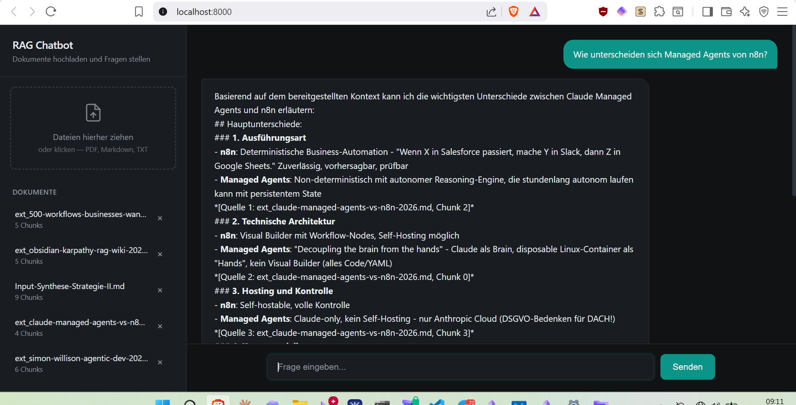

# RAG Chatbot


**Dokumente hochladen, indexieren und per Chat Fragen mit kontextbasierten Antworten stellen.**

RAG (Retrieval-Augmented Generation) Chatbot mit FastAPI, Qdrant Vector DB und Claude via OpenRouter. Lokale Embeddings ohne externe API-Abhaengigkeit.



## Quick Start

```bash
# 1. Clone
git clone https://github.com/mj-deving/rag-prototype.git
cd rag-prototype

# 2. Setup
python3 -m venv venv
source venv/bin/activate
pip install -r requirements.txt

# 3. API Key konfigurieren
echo 'OPENROUTER_API_KEY=sk-or-v1-...' >> ~/.claude/.env
# Oder: export OPENROUTER_API_KEY=sk-or-v1-...

# 4. Server starten
python src/main.py
# -> http://localhost:8000
```

## Features

- **Dokument-Upload** -- PDF, Markdown, TXT per Drag-and-Drop oder API
- **Automatisches Chunking** -- Rekursives Splitting (~500 Tokens, 50 Overlap)
- **Lokale Embeddings** -- fastembed (BAAI/bge-small-en-v1.5, 384-dim, ONNX) -- kein API Key noetig
- **Vector Search** -- Qdrant In-Memory mit Cosine Similarity
- **LLM-Antworten** -- Claude via OpenRouter mit Quellenangaben
- **Chat UI** -- Single-Page HTML mit Dark Theme, responsive
- **REST API** -- 4 Endpoints mit Swagger UI unter `/docs`

## Architektur

```
Browser (localhost:8000)
    |
    v
FastAPI (src/api.py)
    |
    +-- POST /upload --> document_processor.py
    |                      extract_text (PyMuPDF / Markdown)
    |                      chunk_text (recursive split)
    |                      embed_texts (fastembed ONNX)
    |                          |
    |                          v
    |                    vector_store.py
    |                      Qdrant In-Memory (384-dim, Cosine)
    |
    +-- POST /query  --> rag_engine.py
    |                      embed_query (fastembed)
    |                      search (Qdrant top-k)
    |                      generate (Claude via OpenRouter)
    |
    +-- GET /documents --> vector_store.py (list)
    +-- DELETE /documents/{id} --> vector_store.py (delete)
```

## API Endpoints

| Methode | Pfad | Beschreibung |
|---------|------|--------------|
| `POST` | `/upload` | Datei hochladen und indexieren |
| `POST` | `/query` | Frage stellen, Antwort mit Quellen |
| `GET` | `/documents` | Alle indexierten Dokumente auflisten |
| `DELETE` | `/documents/{id}` | Dokument und Vektoren entfernen |

### Beispiele

```bash
# Dokument hochladen
curl -X POST http://localhost:8000/upload \
  -F "file=@dokument.md"

# Frage stellen
curl -X POST http://localhost:8000/query \
  -H "Content-Type: application/json" \
  -d '{"question": "Was ist der November-2025-Wendepunkt?", "top_k": 5}'

# Dokumente auflisten
curl http://localhost:8000/documents

# Dokument loeschen
curl -X DELETE http://localhost:8000/documents/{document_id}
```

## Projektstruktur

```
src/
  api.py                 # FastAPI Endpoints
  document_processor.py  # Text-Extraktion, Chunking, Embedding
  vector_store.py        # Qdrant In-Memory Wrapper
  rag_engine.py          # RAG Pipeline (Retrieve + Generate)
  main.py                # Server-Startup
static/
  index.html             # Chat UI (Single-File, kein Build)
scripts/
  upload_test_docs.py    # 5 Testdokumente hochladen + abfragen
tests/
  test_document_processor.py
  test_vector_store.py
  test_api.py
```

## Tech Stack

| Komponente | Tool |
|------------|------|
| API Framework | FastAPI + Uvicorn |
| Vector DB | Qdrant (In-Memory, kein Docker noetig) |
| Embeddings | fastembed / BAAI/bge-small-en-v1.5 (ONNX, lokal) |
| LLM | Claude Sonnet via OpenRouter |
| PDF Parsing | PyMuPDF |
| Frontend | Vanilla HTML/CSS/JS |

## Tests

```bash
pytest tests/ -v
# 25 Tests: document_processor (9), vector_store (7), api (9)
```

## Konfiguration

Der Server liest API Keys aus `~/.claude/.env` oder Umgebungsvariablen:

| Variable | Zweck |
|----------|-------|
| `OPENROUTER_API_KEY` | LLM-Zugang (Claude via OpenRouter) |

Embeddings laufen lokal -- kein weiterer Key noetig.

## Einschraenkungen

- **In-Memory**: Qdrant-Daten gehen bei Server-Neustart verloren
- **Embedding-Modell**: bge-small-en-v1.5 ist gut fuer Englisch, akzeptabel fuer Deutsch
- **Kein Auth**: Prototype ohne Authentifizierung

## License

MIT
