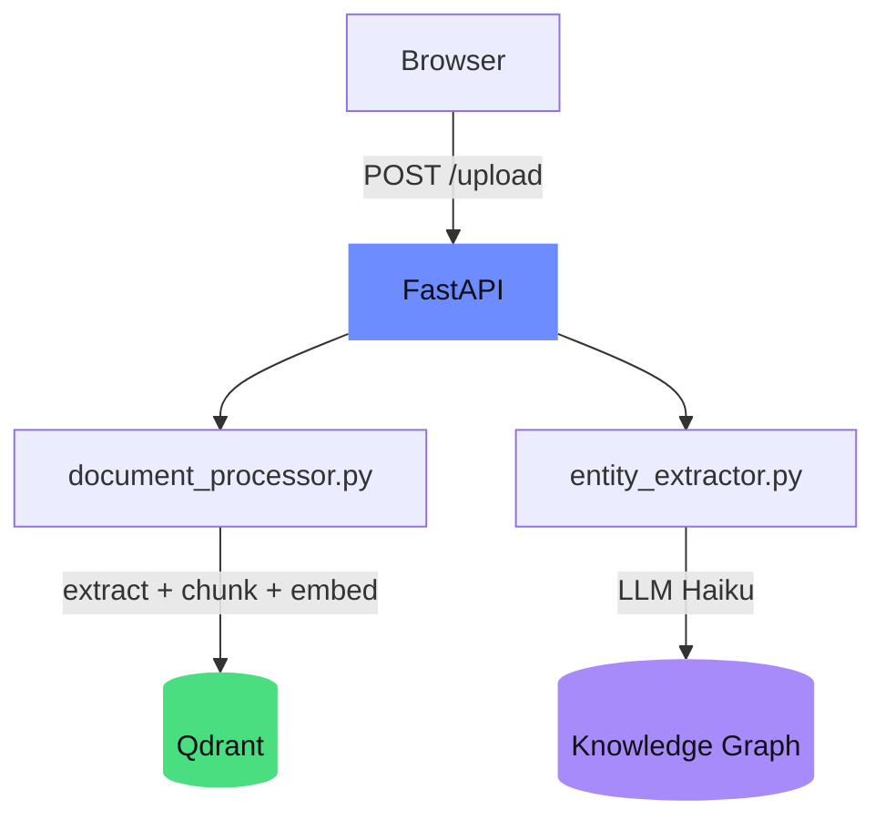
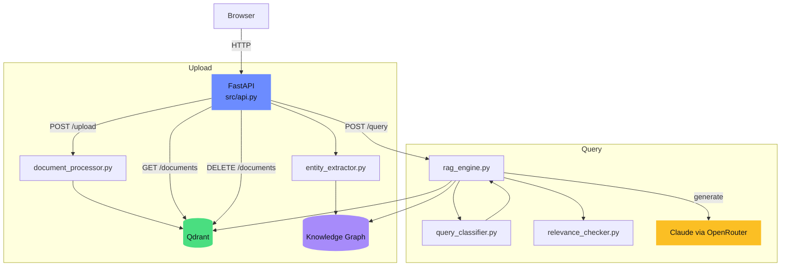

# RAG Hybrid Chatbot

[](#tech-stack)
[](#tech-stack)
[](#tests)
[](#quick-start-docker)
[](#license)

**Hybrid RAG: Vector Search + Knowledge Graph with adaptive query routing.**

RAG (Retrieval-Augmented Generation) chatbot combining Vector Search (Qdrant), Graph RAG (NetworkX), Adaptive Routing, and CRAG. FastAPI backend, Claude via OpenRouter, local embeddings with no external API dependency.


## Table of Contents

- [Quick Start (Docker)](#quick-start-docker) — one command, running
- [Quick Start (Local)](#quick-start-local) — venv + pip
- [Features](#features) — what the chatbot does
- [Architecture](#architecture) — Upload Pipeline, Query Pipeline, System Overview
- [Query Routing](#query-routing) — 4 routes compared
- [API Endpoints](#api-endpoints) — REST API with examples
- [Project Structure](#project-structure) — files and modules
- [Tech Stack](#tech-stack) — versions and components
- [Tests](#tests) — 61 tests, no API calls needed
- [Configuration](#configuration) — environment variables
- [License](#license)

## Quick Start (Docker)

```bash
# 1. Clone
git clone https://github.com/mj-deving/rag-hybrid-chatbot.git
cd rag-hybrid-chatbot

# 2. Configure API key
echo 'OPENROUTER_API_KEY=sk-or-v1-...' > .env

# 3. Start
docker compose up --build
# -> http://localhost:8000
```

Vector data is persisted in `data/qdrant/` and the knowledge graph in `data/graph.json` — both survive container restarts.

## Quick Start (Local)

```bash
# 1. Clone
git clone https://github.com/mj-deving/rag-hybrid-chatbot.git
cd rag-hybrid-chatbot

# 2. Setup
python3 -m venv venv
source venv/bin/activate
pip install -r requirements.txt

# 3. Configure API key
echo 'OPENROUTER_API_KEY=sk-or-v1-...' >> ~/.claude/.env
# Or: export OPENROUTER_API_KEY=sk-or-v1-...

# 4. Start server
python src/main.py
# -> http://localhost:8000
```

## Features

- **Document Upload** — PDF, Markdown, TXT via drag-and-drop or API
- **Automatic Chunking** — Recursive splitting (~500 tokens, 50 overlap)
- **Local Embeddings** — fastembed (paraphrase-multilingual-MiniLM-L12-v2, 384-dim, ONNX) — no API key needed
- **Vector Search** — Qdrant with Cosine Similarity, persistent file-based
- **Graph RAG** — Knowledge graph of entities and relations (NetworkX), auto-extracted on upload
- **Adaptive RAG** — 4-way query routing: simple, standard, complex, relational
- **Corrective RAG (CRAG)** — Post-retrieval relevance check filters irrelevant chunks
- **LLM Answers** — Claude via OpenRouter with source citations
- **Chat UI** — Single-page HTML with dark theme, responsive
- **REST API** — 4 endpoints with Swagger UI at `/docs`

## Architecture

### Upload Pipeline



### Query Pipeline


### System Overview



## Query Routing

The classifier automatically decides which route to use based on the question:

| Route | When | Retrieval | Graph | Example |
|-------|------|-----------|-------|---------|
| **simple** | General knowledge questions | — | — | "What is RAG?" |
| **standard** | Document-specific questions | Vector Search + CRAG | — | "What does the report say about Q4?" |
| **complex** | Comparative multi-aspect questions | Parallel sub-queries + CRAG | Context | "Compare the RAG architectures" |
| **relational** | Relationships between entities | Fallback | Traversal | "Who works with whom?" |

## API Endpoints

| Method | Path | Description |
|--------|------|-------------|
| `POST` | `/upload` | Upload and index a document |
| `POST` | `/query` | Ask a question, get answer with sources |
| `GET` | `/documents` | List all indexed documents |
| `DELETE` | `/documents/{id}` | Remove a document and its vectors |

### `POST /upload`

```bash
curl -X POST http://localhost:8000/upload -F "file=@document.md"
```

**Response:**
```json
{
  "document_id": "a1b2c3d4e5f6",
  "filename": "document.md",
  "chunks": 3,
  "status": "indexed"
}
```

### `POST /query`

```bash
curl -X POST http://localhost:8000/query \
  -H "Content-Type: application/json" \
  -d '{"question": "What does the report say about Q4 results?", "top_k": 5}'
```

**Response:**
```json
{
  "answer": "According to the document...",
  "sources": [
    {"document": "report.md", "chunk": 2, "relevance": 0.8734}
  ],
  "tokens_used": 1250,
  "routing": {
    "route": "standard",
    "sub_queries": [],
    "entity_names": []
  },
  "retrieval_quality": {
    "chunks_retrieved": 5,
    "chunks_relevant": 3,
    "chunks_filtered": 2,
    "fallback_triggered": false
  },
  "graph_entities": null
}
```

### `POST /query` (relational)

```bash
curl -X POST http://localhost:8000/query \
  -H "Content-Type: application/json" \
  -d '{"question": "Which organizations collaborate?"}'
```

**Response (with graph entities):**
```json
{
  "answer": "The knowledge graph shows the following connections...",
  "sources": [],
  "tokens_used": 800,
  "routing": {
    "route": "relational",
    "sub_queries": [],
    "entity_names": ["Acme Corp", "TechStart GmbH"]
  },
  "graph_entities": [
    {
      "name": "Acme Corp",
      "type": "organization",
      "neighbors": [
        {"entity": "TechStart GmbH", "relation": "collaborates_with"}
      ]
    }
  ]
}
```

### Other Endpoints

```bash
# List documents
curl http://localhost:8000/documents

# Delete a document
curl -X DELETE http://localhost:8000/documents/{document_id}
```

## Project Structure

```
rag-hybrid-chatbot/
├── src/
│   ├── api.py                 # FastAPI endpoints
│   ├── llm_client.py          # Shared OpenRouter client + constants
│   ├── query_classifier.py    # Adaptive RAG: 4-way query routing
│   ├── relevance_checker.py   # CRAG: post-retrieval relevance check
│   ├── document_processor.py  # Text extraction, chunking, embedding
│   ├── vector_store.py        # Qdrant persistent storage
│   ├── knowledge_graph.py     # Knowledge graph (NetworkX, JSON-persistent)
│   ├── entity_extractor.py    # LLM-based entity extraction
│   ├── rag_engine.py          # RAG orchestrator
│   └── main.py                # Server startup
├── static/
│   └── index.html             # Chat UI (single-file, no build step)
├── scripts/
│   └── upload_test_docs.py    # Upload test docs + run a query
├── tests/                     # 61 pytest tests
├── Dockerfile                 # Python 3.12-slim
├── docker-compose.yml         # One-command setup
├── requirements.txt
└── README.md
```

## Tech Stack

| Component | Tool | Version |
|-----------|------|---------|
| Runtime | Python | 3.12+ |
| API Framework | FastAPI + Uvicorn | 0.135 / 0.44 |
| Vector DB | Qdrant (persistent file-based) | 1.17 |
| Embeddings | fastembed / multilingual-MiniLM-L12-v2 (ONNX) | 0.8 |
| Knowledge Graph | NetworkX (in-memory, JSON-persistent) | 3.6 |
| LLM | Claude Sonnet via OpenRouter | openai 2.31 |
| PDF Parsing | PyMuPDF | 1.27 |
| Frontend | Vanilla HTML/CSS/JS | — |
| Container | Docker + Compose | — |

## Tests

All tests run locally without API calls (LLM is mocked):

```bash
source venv/bin/activate
pytest tests/ -v
```

61 tests across 8 modules:

| Module | Tests | Covers |
|--------|-------|--------|
| `test_document_processor.py` | 9 | Text extraction, chunking, embedding dimensions |
| `test_vector_store.py` | 7 | Upsert, search, list, delete |
| `test_knowledge_graph.py` | 14 | Graph CRUD, traversal, persistence, singleton |
| `test_entity_extractor.py` | 5 | LLM extraction, error handling, parse failures |
| `test_query_classifier.py` | 6 | All 4 routes + fallback |
| `test_relevance_checker.py` | 5 | CRAG filter, confidence thresholds |
| `test_api.py` | 14 | Upload, query, delete, auth, Swagger |
| `test_main.py` | 1 | Env loading |

## Configuration

The server reads API keys from `~/.claude/.env` or environment variables:

| Variable | Purpose | Default |
|----------|---------|---------|
| `OPENROUTER_API_KEY` | LLM access (Claude via OpenRouter) | (required) |
| `RAG_API_KEY` | Bearer token for API auth | (empty = auth disabled) |
| `EMBEDDING_MODEL` | fastembed model name | `sentence-transformers/paraphrase-multilingual-MiniLM-L12-v2` |
| `EMBEDDING_DIM` | Vector dimension | `384` |
| `QDRANT_PATH` | Path for Qdrant data | `data/qdrant/` |
| `GRAPH_PATH` | Path for knowledge graph | `data/graph.json` |

Embeddings run locally — no additional API key needed.
For English-only corpora: `EMBEDDING_MODEL=BAAI/bge-small-en-v1.5`.

## License

MIT
